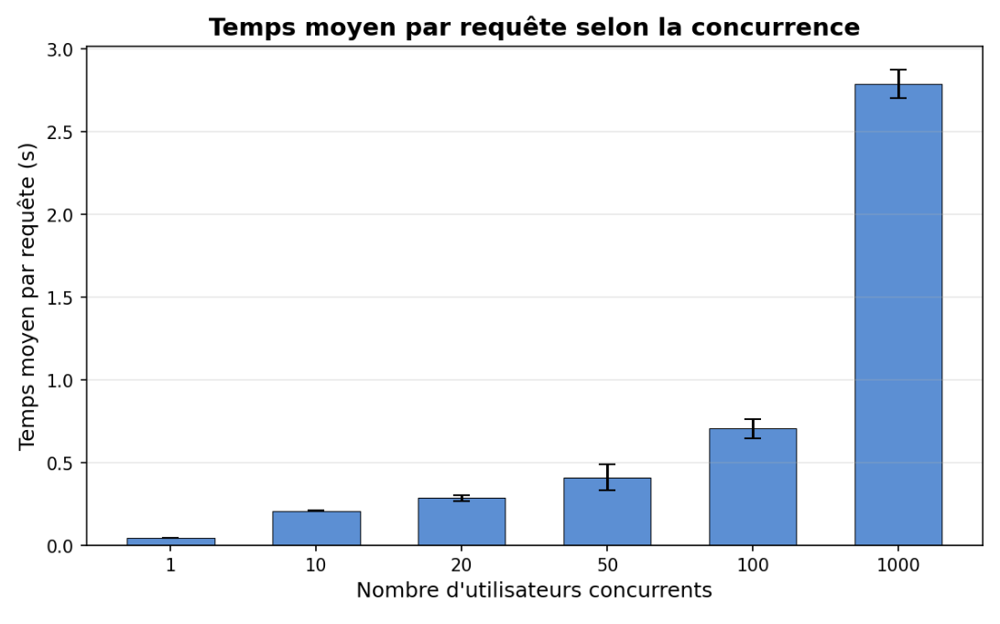
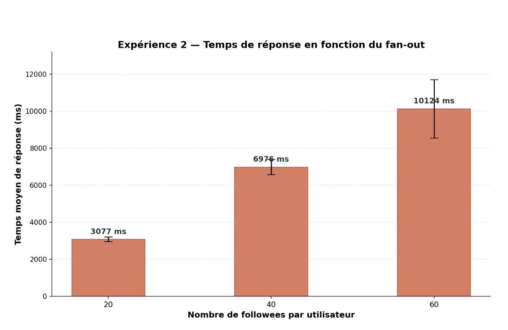

# TinyInsta — Does it Scale?

## Objectif

Ce projet évalue le passage à l'échelle de **TinyInsta**, un réseau social minimaliste déployé sur Google App Engine. Deux expériences de benchmark ont été menées avec [Locust](https://locust.io/) pour mesurer le temps moyen d'une requête `/api/timeline` :

1. **Concurrence** — nombre d'utilisateurs simultanés croissant (données fixes)
2. **Fan-out** — nombre de followees croissant (concurrence fixe)

## Webapp

🔗 **URL de l'application déployée** : _https://tp-tiny-insta-enzo-sam.ew.r.appspot.com_

---

## Expérience 1 — Passage à l'échelle sur la charge (concurrence)

**Paramètres fixes** : 1000 utilisateurs, 50 posts/utilisateur, 20 followees/utilisateur.
**Variable** : nombre d'utilisateurs simultanés distincts (1, 10, 20, 50, 100, 1000).
Chaque mesure est répétée 3 fois (60s par run).

### Résultats

| PARAM | Run 1 | Run 2 | Run 3 | Moyenne | Instances (max) |
|-------|-------|-------|-------|---------|-----------------|
| 1     | 45ms  | 45ms  | 47ms  | 46ms    | 2               |
| 10    | 207ms | 209ms | 212ms | 209ms   | 2               |
| 20    | 312ms | 276ms | 271ms | 286ms   | 3               |
| 50    | 520ms | 383ms | 332ms | 412ms   | 12              |
| 100   | 657ms | 672ms | 787ms | 705ms   | 12              |
| 1000  | 2710ms| 2908ms| 2747ms| 2788ms  | 16              |

### Graphique

### Interprétation

Le temps moyen par requête augmente progressivement avec le nombre d'utilisateurs concurrents. Pour 1 utilisateur, la latence est très faible (~46ms). Elle reste raisonnable jusqu'à 50 utilisateurs (~412ms), puis augmente significativement à 100 utilisateurs (~705ms) et explose à 1000 utilisateurs (~2.8s).

L'autoscaling de Google App Engine fonctionne : le nombre d'instances passe de 2 à 16 au fur et à mesure que la charge augmente. Cependant, cette montée en charge n'est pas instantanée, et le nombre d'instances plafonne (max observé : 16), ce qui explique la dégradation à 1000 utilisateurs. Le throughput sature car les instances disponibles ne suffisent plus à absorber toutes les requêtes, qui s'accumulent en file d'attente.

Le taux d'erreur reste très faible (<0.1%) sur tous les niveaux, les quelques erreurs étant des `ConnectionRefused` transitoires pendant les phases de scale-up.

**Conclusion** : oui, TinyInsta scale sur la charge, mais de manière limitée. L'autoscaling absorbe bien la montée de 1 à 50 utilisateurs. Au-delà, le système atteint les limites de son nombre d'instances, et la latence se dégrade fortement. C'est un comportement logique et attendu pour une application App Engine avec un plafond d'instances.

---

## Expérience 2 — Passage à l'échelle sur la taille des données (fan-out)

**Paramètres fixes** : 1000 utilisateurs, 100 posts/utilisateur, 50 utilisateurs simultanés.
**Variable** : nombre de followees par utilisateur (20, 40, 60).
Chaque mesure est répétée 3 fois (60s par run).

### Résultats

| PARAM | Run 1   | Run 2   | Run 3   | Moyenne  | Instances (max) |
|-------|---------|---------|---------|----------|-----------------|
| 20    | 392ms   | 124ms   | 95ms    | 204ms    | 22              |
| 40    | 8165ms  | 2841ms  | 1780ms  | 4262ms   | 23              |
| 60    | 9588ms  | 3803ms  | 2431ms  | 5274ms   | ~0*             |

*\*Le nombre d'instances n'a pas pu être relevé correctement pour le niveau 60.*

### Graphique

### Interprétation

Le temps moyen augmente très fortement avec le nombre de followees. Passer de 20 à 40 followees multiplie le temps par ~20 (204ms → 4.2s), et passer à 60 followees l'augmente encore (~5.3s). C'est logique : chaque requête timeline doit récupérer les posts de tous les utilisateurs suivis. Plus le fan-out est grand, plus le nombre de lectures dans Datastore est élevé, et plus la requête est coûteuse.

On observe aussi une **forte variance** entre les runs d'un même niveau (barres d'erreur importantes). Cela s'explique par l'effet de warm-up de l'autoscaler : le run 1 démarre avec très peu d'instances (4), tandis que les runs 2 et 3 bénéficient des instances déjà provisionnées par les runs précédents. Par exemple, pour 20 followees, le run 1 met 392ms (4 instances) contre 95ms pour le run 3 (22 instances).

**Conclusion** : TinyInsta ne scale pas bien sur la taille des données. Le modèle de lecture actuel (fan-out on read) est directement proportionnel au nombre de followees. Pour améliorer cela, il faudrait envisager un modèle de fan-out on write (pré-calculer les timelines à l'écriture) ou mettre en place un cache (Memcache/Redis) pour éviter de relire Datastore à chaque requête.

---

## Conclusion générale

TinyInsta scale **horizontalement** grâce à l'autoscaling d'App Engine : le nombre d'instances augmente automatiquement avec la charge, ce qui permet de maintenir des performances acceptables jusqu'à environ 50 utilisateurs simultanés.

En revanche, le passage à l'échelle est limité par deux facteurs :
- Le **plafond d'instances** de l'autoscaler, qui empêche d'absorber des charges très élevées (1000 users).
- Le **modèle de lecture fan-out on read**, qui rend le coût d'une requête timeline proportionnel au nombre de followees, sans possibilité de paralléliser efficacement les lectures Datastore.

Pour aller plus loin, les pistes d'amélioration seraient : augmenter la limite d'instances, implémenter un cache devant Datastore, et/ou passer à un modèle fan-out on write.
